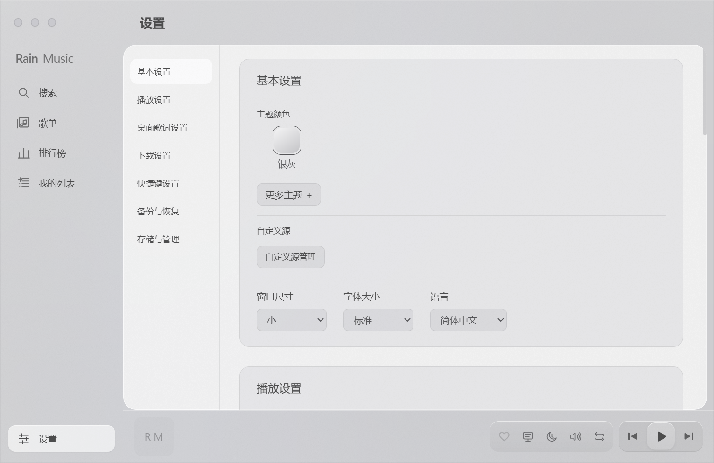

<p align="center"></p>

<h1 align="center">Rain Music</h1>

<p align="center">基于 Electron、Vue 3 和 TypeScript 的桌面音乐播放器 · v1.0.0</p>

<p align="center">
  <a href="https://github.com/chaoy1/Rain-Music/releases">下载与版本</a> ·
  <a href="./FAQ.md">使用帮助</a> ·
  <a href="./CHANGELOG.md">更新日志</a> ·
  <a href="./LICENSE">Apache-2.0</a>
</p>

## 功能

- 搜索歌曲、浏览在线歌单与排行榜，管理本地播放列表。
- 点击歌曲红心选择要添加的歌单；红心反映歌曲是否已在自建歌单中。
- 播放控制、进度调整、音量控制、歌词详情与桌面歌词。未选择歌曲时隐藏时间轴。
- 浅色、深色和跟随系统主题，壁纸与窗口外观设置。
- 连续滚动的设置页面；低频选项折叠，常用项使用紧凑选择控件。
- 自定义音乐源、快捷键、下载管理和数据备份。

在线音频链接由用户导入的自定义源提供。接口说明见 [自定义源文档](./docs/custom-source.md)。

## 界面



## 安装与数据

v1.0.0 的发布目标为 **Windows 10/11 x64**。下载后解压目录版并运行 `rain-music-desktop.exe`。
macOS、Linux 和其他架构保留构建入口，尚未完成此版本的运行验证。

默认数据目录为 `%APPDATA%/rain-music-desktop`，歌单和设置位于其 `RainDatas` 子目录。
Windows 下在程序旁创建 `portable` 文件夹即可使用便携模式，数据位于 `portable/userData`。
升级前可在“设置 → 备份与恢复”导出备份；应用版本与内部配置迁移版本独立管理。

## 本地开发

需要 Node.js 22.15+、npm 8.5+。仓库默认分支为 `master`。

```powershell
git clone https://github.com/chaoy1/Rain-Music.git
cd Rain-Music
npm ci
npm run dev
```

```powershell
npm run verify   # 类型检查、单元测试、含 lint 的完整构建
npm run test:ui  # Electron 交互回归，需要图形桌面
npm run pack:dir # 构建并打包目录版
```

更多命令、目录说明和发布流程见 [开发与发布](./docs/development.md)。

## 贡献与协议

Bug 反馈请附版本、系统、复现步骤和截图；提交 PR 至 `master`，并说明验证结果。
第三方依赖及许可证保留在 [vendor](./vendor/README.md) 和 [licenses](./licenses)。
项目许可证见 [LICENSE](./LICENSE)，原有补充协议见 [项目使用协议](./docs/usage.md)。
